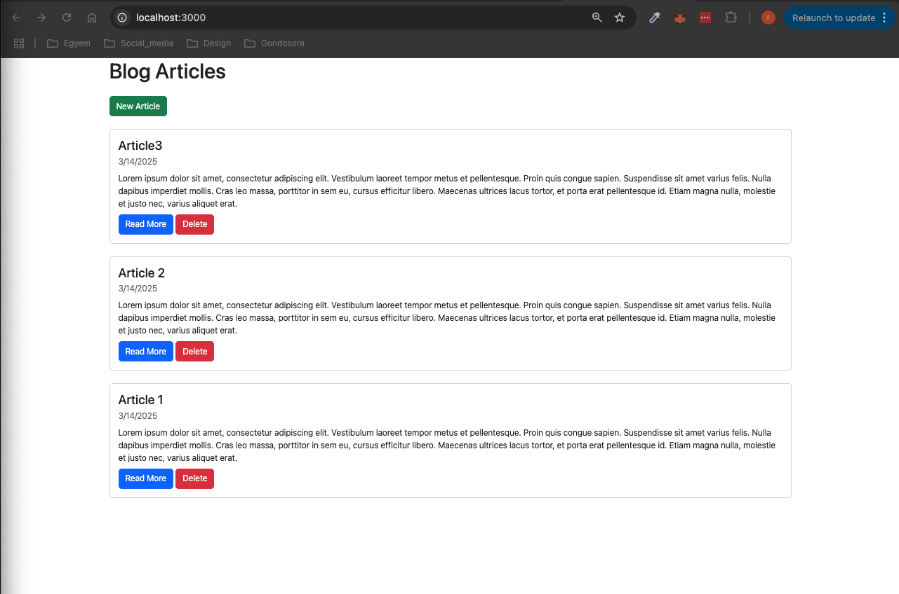
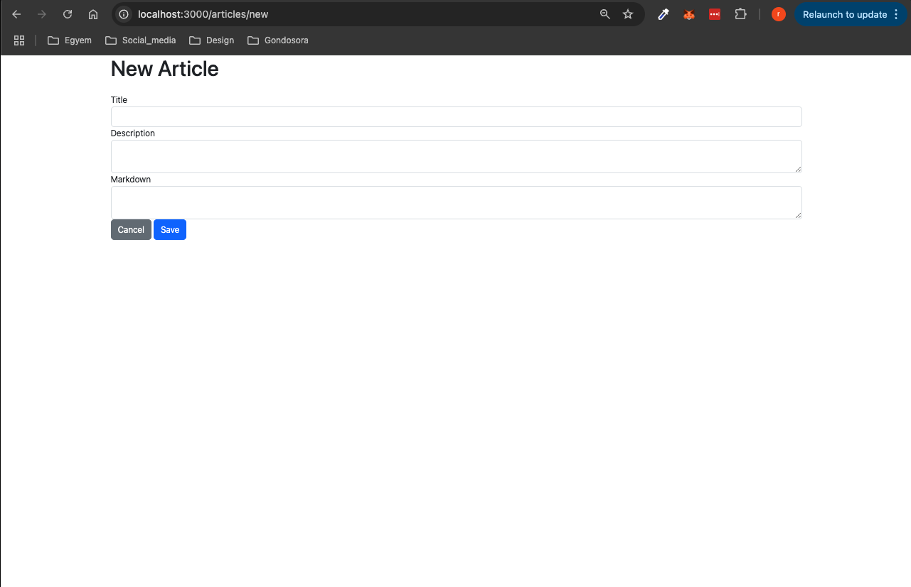

# Markdown Blog

This is a simple **Markdown blog** built using **Node.js, Express, MongoDB, and EJS**, following [this tutorial](https://www.youtube.com/watch?v=1NrHkjlWVhM&t=1718s) by the fantastic [Web Dev Simplified](https://www.youtube.com/@WebDevSimplified). The blog allows users to write and store posts, which is then rendered into HTML.

## 🛠 Technologies Used

- **Node.js** – Backend runtime
- **Express.js** – Web framework for handling routes and requests
- **MongoDB** – Database for storing blog posts
- **Mongoose** – ODM for MongoDB
- **EJS (Embedded JavaScript)** – Template engine for rendering dynamic pages

---

## 📸 Screenshots





## 🚀 Features

✔️ Create, edit, and delete blog posts  
✔️ Store posts in **MongoDB**  
✔️ User-friendly interface with **EJS templates**  
✔️ RESTful API routes

---

## 📦 Installation & Setup

1️⃣ Clone the Repository

```bash
git clone https://github.com/L4r4TW/Markdown_blog
cd markdown_blog
```

2️⃣ Install Dependencies

```bash
npm install
```

3️⃣ Start the Application

```bash
node server.js
```

The blog will be accessible at: http://localhost:3000

⸻

## 🤝 Contributing

Contributions are welcome! If you’d like to improve the project: 1. Fork the repository. 2. Create a feature branch:

```bash
git checkout -b feature-new-feature
```

    3.	Commit your changes:

```bash
git commit -m "Added new feature"
```

    4.	Push to your branch:

```bash
git push origin feature-new-feature
```

    5.	Open a pull request.

⸻

## 📝 License

This project is open-source and available under the MIT License.

⸻

## 📬 Contact

If you have any questions or suggestions, feel free to reach out!
• GitHub: @L4r4TW
• Discord: l4r4TW

⸻

🔥 Happy Coding! 🚀

---
